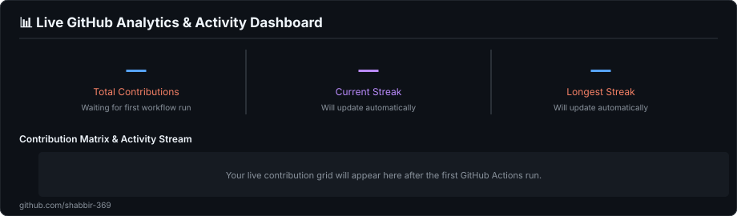

# Shabbir Ezzy

  <em>I love putting my head down and building — with great people or on my own. 
  Taking an idea, figuring it out, and turning it into something real.</em>

  <a href="https://github.com/shabbir-369">GitHub</a> ·
  <a href="https://linkedin.com/in/shabbir-ezzy/">LinkedIn</a> ·
  <a href="mailto:codewithshabbir@gmail.com">Email</a>

---

## 📊 Live GitHub Analytics & Activity Dashboard

  

---

## 🛠️ Things I Build With

  

---

## 🚀 Things I've Built

<table>
  <tr>
    <td width="50%" valign="top">
      <h3>Project Pulse AI</h3>
      
AI execution intelligence for infrastructure projects — connecting field progress with schedules and downstream impact.

      
<code>React</code> <code>Node.js</code> <code>AI</code> <code>Graph/CPM</code>

    </td>
    <td width="50%" valign="top">
      <h3>AgriSense</h3>
      
IoT + AI agriculture monitoring and prediction system using field sensors, weather data and visual inputs.

      
<code>ESP32</code> <code>React</code> <code>Node.js</code> <code>AI</code>

    </td>
  </tr>
  <tr>
    <td width="50%" valign="top">
      <h3>Practice Ledger</h3>
      
A focused DSA practice tracker with curriculum progress, sessions, timers and an immutable practice log.

      
<code>React</code> <code>Firebase</code> <code>JavaScript</code>

    </td>
    <td width="50%" valign="top">
      <h3>Ezzy Hardware</h3>
      
A modern online presence for a hardware business, with product discovery, filters and WhatsApp-based checkout flow.

      
<code>React</code> <code>Node.js</code> <code>JavaScript</code>

    </td>
  </tr>
</table>

---

## 🧭 What I'm Focused On

**DSA · Full-Stack Engineering · Computer Science Fundamentals · AI/IoT · Building in Public**

---

  Built with Markdown, GitHub Actions and a little automation.

