  <picture>
    <source media="(prefers-color-scheme: dark)" srcset="./assets/profile-dark.svg" />
    <source media="(prefers-color-scheme: light)" srcset="./assets/profile-light.svg" />
    
  </picture>

  <picture>
    <source media="(prefers-color-scheme: dark)" srcset="https://raw.githubusercontent.com/shabbir-369/shabbir-369/output/github-contribution-grid-snake-dark.svg" />
    <source media="(prefers-color-scheme: light)" srcset="https://raw.githubusercontent.com/shabbir-369/shabbir-369/output/github-contribution-grid-snake.svg" />
    
  </picture>

  <a href="https://github.com/shabbir-369">GitHub</a> ·
  <a href="#">LinkedIn</a> ·
  <a href="mailto:you@example.com">Email</a>

