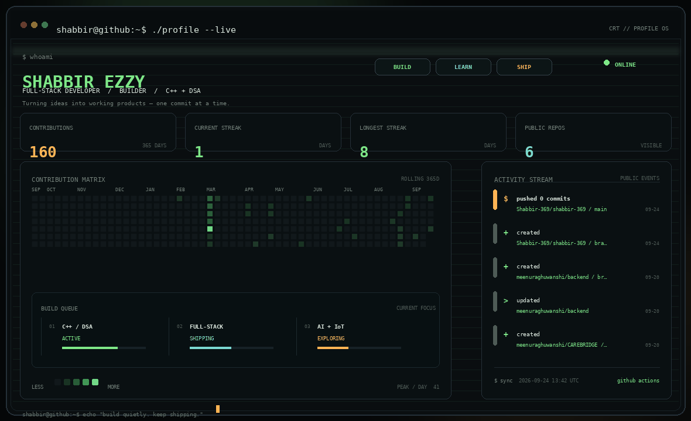

<div align="center">

# SHABBIR EZZY

**Full-Stack Developer · Builder · C++ / DSA · AI + IoT**

`build` → `break` → `debug` → `learn` → `ship`

[GitHub](https://github.com/Shabbir-369) ·
[LinkedIn](https://www.linkedin.com/in/shabbir-ezzy/) ·
[Email](mailto:codewithshabbir@gmail.com)

</div>



<div align="center">

### `> SYSTEM ONLINE`

I learn by building — taking an idea, figuring it out, and turning it into something real.

</div>

---

## `~/about`

```text
NAME        : Shabbir Ezzy
ROLE        : Full-Stack Developer / Builder
CURRENT     : B.Tech IT
FOCUS       : C++ • DSA • CS Fundamentals • Full-Stack Engineering
EXPLORING   : AI • IoT • Systems
MINDSET     : Build things that actually work.
```

## `~/stack`

**Languages**

`C++` `JavaScript` `Python` `SQL`

**Frontend / Backend**

`React` `Node.js` `Express` `Next.js`

**Data / Infra**

`MySQL` `Firebase` `Supabase` `Redis` `Git` `GitHub`

**Exploration**

`AI/ML` `IoT` `Arduino` `ESP32` `Raspberry Pi`

## `~/projects`

| Project | What it does |
| --- | --- |
| **Project Pulse AI** | AI execution intelligence that connects field progress with project schedules and downstream impact. |
| **AgriSense** | IoT + AI agriculture monitoring using sensor, weather and visual data. |
| **Practice Ledger** | A DSA practice tracker with curriculum progress, focused sessions, timers and an immutable log. |
| **Ezzy Hardware** | A modern online presence for a hardware business with product discovery and WhatsApp checkout. |

## `~/currently`

```text
[■■■■■■■■■■■■■■■■□□] C++ / DSA
[■■■■■■■■■■■■■■□□□] Full-Stack Engineering
[■■■■■■■■■■■■■□□□□] CS Fundamentals
[■■■■■■■■■■■■□□□□□] AI / IoT
```

## `~/philosophy`

> Curiosity in.  
> Code out.  
> Repeat.

<div align="center">

`EOF`

<br/>

**Built quietly. Keep shipping.**

</div>
