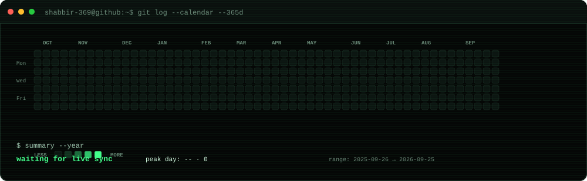
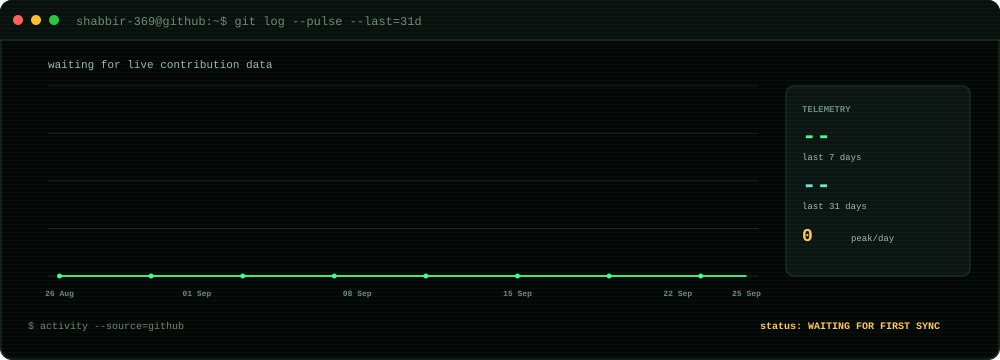
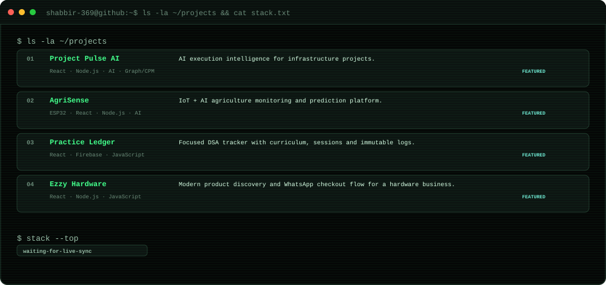

  <picture>
    <source media="(prefers-color-scheme: dark)" srcset="./assets/profile-dark.svg" />
    <source media="(prefers-color-scheme: light)" srcset="./assets/profile-light.svg" />
    
  </picture>

  <picture>
    <source media="(prefers-color-scheme: dark)" srcset="./assets/contributions-dark.svg" />
    <source media="(prefers-color-scheme: light)" srcset="./assets/contributions-light.svg" />
    
  </picture>

  <picture>
    <source media="(prefers-color-scheme: dark)" srcset="./assets/activity-dark.svg" />
    <source media="(prefers-color-scheme: light)" srcset="./assets/activity-light.svg" />
    
  </picture>

  <picture>
    <source media="(prefers-color-scheme: dark)" srcset="./assets/projects-dark.svg" />
    <source media="(prefers-color-scheme: light)" srcset="./assets/projects-light.svg" />
    
  </picture>

  <code>guest@shabbir-369:~$ ./connect.sh</code>
    
  <a href="https://github.com/Shabbir-369">GitHub</a> &nbsp;·&nbsp;
  <a href="https://www.linkedin.com/in/shabbir-ezzy/">LinkedIn</a> &nbsp;·&nbsp;
  <a href="mailto:codewithshabbir@gmail.com">Email</a>

<pre>
shabbir@github:~$ echo "build it. break it. understand it. improve it."
build it. break it. understand it. improve it.

shabbir@github:~$ exit
connection closed.
</pre>
