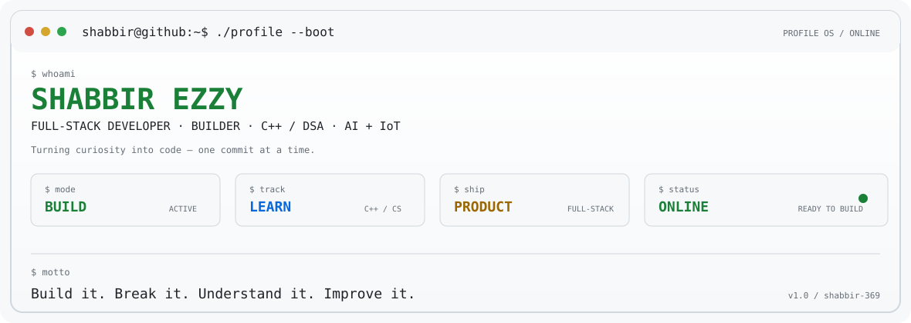

<picture>
  <source media="(prefers-color-scheme: dark)" srcset="./assets/terminal-boot-dark.svg">
  <source media="(prefers-color-scheme: light)" srcset="./assets/terminal-boot-light.svg">
  
</picture>

<pre>
$ whoami
shabbir-369

$ cat ./profile.txt
B.Tech IT student      |      Full-Stack Developer      |      Builder
C++ / DSA              |      AI + IoT                  |      Product-minded

"I like putting my head down, figuring things out, and turning ideas into something real."
</pre>

<code>$ connect --with</code>&nbsp;&nbsp;
<a href="https://github.com/Shabbir-369">github</a>&nbsp;&nbsp;·&nbsp;&nbsp;
<a href="https://www.linkedin.com/in/shabbir-ezzy/">linkedin</a>&nbsp;&nbsp;·&nbsp;&nbsp;
<a href="mailto:codewithshabbir@gmail.com">email</a>

 

<pre>
$ ./profile --live
┌──────────────────────────────────────────────────────────────────────────────┐
│ LIVE TELEMETRY :: public GitHub data                                        │
│                                                                              │
│ The panel below is generated from live GitHub profile data.                 │
│ It includes repository stats, language usage, activity and profile uptime.  │
└──────────────────────────────────────────────────────────────────────────────┘
</pre>

<picture>
  <source media="(prefers-color-scheme: dark)" srcset="https://github-stats-terminal-style-five.vercel.app/api/stats?username=Shabbir-369&theme=hacker&headerStyle=mac&hostname=shabbir%40github&typingSpeed=55&commands=whoami%2Cneofetch%2Clanguages%2Ctop-repos%2Cps%2Cuptime%2Cexit">
  <source media="(prefers-color-scheme: light)" srcset="https://github-stats-terminal-style-five.vercel.app/api/stats?username=Shabbir-369&theme=github&headerStyle=mac&hostname=shabbir%40github&typingSpeed=55&commands=whoami%2Cneofetch%2Clanguages%2Ctop-repos%2Cps%2Cuptime%2Cexit">
  
</picture>

 

<pre>
$ git log --contributions --rolling
</pre>

<picture>
  <source media="(prefers-color-scheme: dark)" srcset="https://ghchart.xqsit94.in/dark:7ee787/Shabbir-369">
  <source media="(prefers-color-scheme: light)" srcset="https://ghchart.xqsit94.in/light:1a7f37/Shabbir-369">
  
</picture>

 

<pre>
$ git log --activity --last=31d
</pre>

<picture>
  <source media="(prefers-color-scheme: dark)" srcset="https://github-readme-activity-graph.vercel.app/graph?username=Shabbir-369&amp;bg_color=070a0c&amp;color=d7e0d9&amp;line=7ee787&amp;point=ffb454&amp;area=true&amp;area_color=1b492b&amp;border_color=2a3338&amp;hide_border=false&amp;custom_title=%24%20git%20log%20--activity&amp;radius=8&amp;days=31">
  <source media="(prefers-color-scheme: light)" srcset="https://github-readme-activity-graph.vercel.app/graph?username=Shabbir-369&amp;bg_color=f6f8fa&amp;color=24292f&amp;line=1a7f37&amp;point=9a6700&amp;area=true&amp;area_color=dff7e5&amp;border_color=d0d7de&amp;hide_border=false&amp;custom_title=%24%20git%20log%20--activity&amp;radius=8&amp;days=31">
  
</picture>

 

<pre>
$ stack --list

LANGUAGES              FRAMEWORKS              SYSTEMS / DATA
─────────              ──────────              ──────────────
C++                    React                   MySQL
JavaScript             Node.js                 Firebase
Python                 Express                 Git / GitHub
C                      Vite                    REST APIs

BUILD MODE             C++ / DSA / FULL-STACK / AI + IoT
</pre>

<pre>
$ ls -la ./projects

drwxr-xr-x  project-pulse-ai
│   AI execution intelligence for infrastructure projects
│   Planning → field progress → schedule impact
│   React · Node.js · AI · dependency graph / CPM
│
├── agrisense
│   IoT + AI agriculture monitoring and prediction
│   ESP32 · sensors · weather · visual data
│
├── practice-ledger
│   Focused DSA practice tracker and immutable practice log
│   React · Firebase · JavaScript
│
└── ezzy-hardware
    Product discovery and WhatsApp checkout experience
    React · Node.js · JavaScript
</pre>

<code>$ open</code>&nbsp;&nbsp;
<a href="https://github.com/Shabbir-369/AgriSense"><code>agrisense</code></a>&nbsp;&nbsp;
<a href="https://github.com/Shabbir-369/DSA"><code>dsa</code></a>&nbsp;&nbsp;
<a href="https://github.com/Shabbir-369"><code>project-pulse-ai</code></a>

<pre>
$ focus --now

[ACTIVE]      C++ / DSA
[BUILDING]    Full-Stack Engineering
[STUDYING]   OOP · OS · DBMS · Computer Networks
[EXPLORING]  AI + IoT

$ philosophy
Build it. Break it. Understand it. Improve it.
</pre>

<pre>
$ exit
session closed.
keep shipping.
</pre>

Terminal-inspired profile · live public GitHub data · theme-aware rendering

