<h1 align="center">Shabbir Ezzy</h1>

Full-stack developer · C++ &amp; DSA · AI / IoT · builder

  

  What I love most is putting my head down and building — with people who care 
  about the craft, or on my own. Taking an idea, figuring it out, and turning it 
  into something that actually works.

 

## 📊 Activity

  <picture>
    <source media="(prefers-color-scheme: dark)" srcset="./assets/dashboard-dark.svg" />
    <source media="(prefers-color-scheme: light)" srcset="./assets/dashboard-light.svg" />
    
  </picture>

  <picture>
    <source media="(prefers-color-scheme: dark)" srcset="https://raw.githubusercontent.com/shabbir-369/shabbir-369/output/github-contribution-grid-snake-dark.svg" />
    <source media="(prefers-color-scheme: light)" srcset="https://raw.githubusercontent.com/shabbir-369/shabbir-369/output/github-contribution-grid-snake.svg" />
    
  </picture>

 

## Things I've built

**Project Pulse AI** — *(SIH 2026, team O(win))*
Turns unstructured field reports into verified schedule updates, using dependency graphs and CPM to work out how a delay ripples through the rest of a project.
`React` `Node.js` `MySQL` `Python / FastAPI` `NLP + OCR`

**CareBridge**
An emergency healthcare navigator app connecting patients, doctors, and hospitals with urgency-first, bilingual flows.
`React` `Node.js` `MySQL`

**Practice Ledger**
A placement-prep tracker for DSA practice — logging, timers, streaks, and a activity heatmap.
`React` `Firebase`

 

## Tools I reach for

  

 

  <a href="https://github.com/shabbir-369">GitHub</a> ·
  <a href="#">LinkedIn</a> ·
  <a href="mailto:you@example.com">Email</a>

